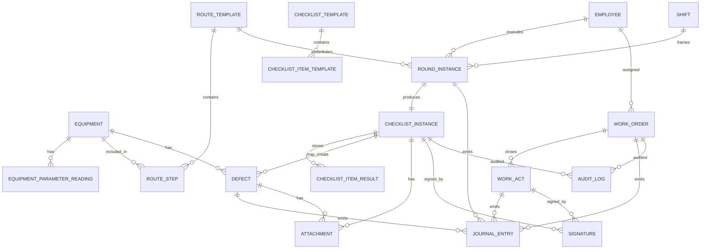
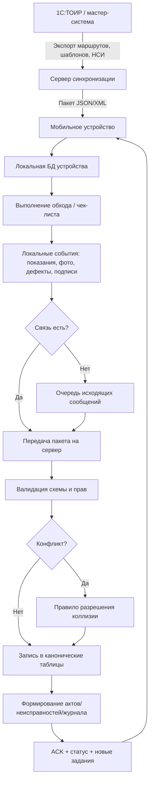

# Форматы хранения данных обходных листов, маршрутных листов, чек-листов, параметров оборудования и журналов для мобильного и веб-приложения ТОиР на контуре 1С

## Executive summary

Для цифровизации обходов, маршрутных листов, чек-листов, карточек оборудования и журналов работ в контуре 1С оптимальна **гибридная модель хранения**: реляционное ядро для юридически значимых документов, связей и аналитики; документные JSON-снимки для печатных форм, мобильных шаблонов и переменных наборов полей; опциональный графовый слой для маршрутов обходов, топологии оборудования и анализа причинно-следственных связей отказов. Такой подход лучше всего согласуется и с юридическими требованиями к первичным документам, и с объектной моделью 1С, и с офлайн-синхронизацией мобильных сценариев. citeturn27view0turn26view5turn26view6turn38view0turn38view2

Для самих бумажных форм в России, как правило, **нет обязательной унифицированной федеральной формы** именно для обходного листа оборудования, маршрутного листа ТОиР или внутреннего чек-листа; организация вправе разрабатывать их самостоятельно, если соблюдает обязательные реквизиты первичного документа и не попадает в специальный отраслевой бланк. Обязательная база — наименование документа, дата, организация, содержание факта хозяйственной жизни, измерители, ответственные лица и подписи/идентификаторы подписантов. При этом отраслевые правила могут добавлять журналы, паспорта, инструкции, осмотры и эксплуатационные записи как обязательный состав документации. citeturn27view0turn8search4turn18search6turn16search0turn16search1turn18search7

По публичной документации и материалам 1С/Деснол, в модели 1С ключевыми сущностями выступают **объекты ремонта**, их **паспортные данные**, **показатели эксплуатации**, **списки объектов регламентных мероприятий**, **графики работы**, **наряды**, **акты**, **дефекты/неисправности**, а также история по объекту и журналы регистрации/обмена. Это означает, что для нового мобильного или веб-приложения не нужно проектировать “с нуля” абстрактную форму, а нужно строить совместимую цифровую модель поверх уже определившихся бизнес-сущностей. citeturn24search3turn24search0turn24search2turn25search3turn25search5turn25search1turn25search9turn24search13turn22search6

Публичные материалы по кейсам мобильных обходов в связке с 1С показывают, что маршрут обхода обычно содержит длительность, способ планирования, список объектов и контролируемых показателей; планировщик обходов — календарь, квалификацию, исполнителя, основание и статусы; чек-лист — последовательность операций; документ неисправности — объект, точку контроля, дату обнаружения, признак критичности и историю контроля. Для проектирования БД это означает, что **чек-лист, маршрут, дефект и журнал событий должны быть разными сущностями**, а не одной “универсальной таблицей формы”. citeturn14view0turn34view0turn34view1turn34view2turn34view3turn19view4turn19view5

Официальная платформа 1С поддерживает XML/XDTO, EnterpriseData, JSON, HTTP- и web-сервисы, OData, универсальный механизм обмена, распределённые информационные базы, мобильный автономный режим и импорт/экспорт табличных документов в XLS/XLSX/ODS. Поэтому для интеграции нового приложения с 1С:ТОИР разумно закладывать: **JSON/HTTP для мобильного API**, **XML/XDTO или EnterpriseData для регламентного обмена**, **XLSX для массовых загрузок/выгрузок**, **отдельную таблицу сообщений обмена**, а для кастомизации 1С — **расширения**, а не модификацию типовой конфигурации. citeturn26view5turn26view6turn26view7turn26view8turn36view3turn36view4turn38view3turn26view3turn26view4

Официальную продуктовую и платформенную документацию для такого проекта следует брать у entity["company","1С","software vendor"] и entity["company","Деснол Софт","eam vendor"], стандарты — у entity["organization","Росстандарт","federal standards body"], требования к первичным документам — у entity["organization","ФНС России","tax authority"], а отраслевые эксплуатационные правила — у entity["organization","Минэнерго России","energy ministry"] и на порталах официального опубликования. Актуальный публично указанный релиз решения 1С:ТОИР КОРП на странице материалов — **3.0.22.5 от 28.02.2026**. citeturn19view3turn19view0

## Нормативный контекст

Нормативную базу для цифрового контура ТОиР удобно разделять на четыре слоя: терминологию и стандартизацию ТОиР/надёжности; требования к эксплуатационной и ремонтной документации; требования к первичным документам, ЭП и данным; отраслевые правила эксплуатации. Для проектов в РФ этого достаточно, чтобы корректно определить реквизиты, журналирование, права и сроки фиксации фактов работ. Для СНГ базовым общим слоем выступают межгосударственные ГОСТ, а поверх них нужно проверять локальные законы о первичных документах и электронной подписи. citeturn32search1turn7search2turn7search2turn31view2turn6search2turn7search3turn27view0turn8search5turn8search2turn8search3

| Группа | Документ | Что фиксирует для проекта |
|---|---|---|
| Термины ТОиР | ГОСТ 18322-2016 | Базовая терминология технического обслуживания и ремонта; полезна для именования сущностей, статусов и бизнес-правил |
| Термины надёжности | ГОСТ 27.002-2015, ГОСТ Р 27.102-2021 | Термины надёжности, отказов, состояний объекта; полезны для параметров оборудования, дефектов и KPI |
| Документация на изделие | ГОСТ Р 2.601-2019, ГОСТ Р 2.610-2019, ГОСТ 2.602-2013 | Состав эксплуатационных и ремонтных документов, сведения о паспортах, формулах, ресурсах, стадиях ремонта |
| Управление активами | ГОСТ Р 55.0.01-2014 | Общая терминология и принципы asset management, на которые прямо ссылается описание решения 1С:ТОИР КОРП |
| Первичные документы РФ | 402-ФЗ, ст. 9 | Обязательные реквизиты любого юридически значимого документа о факте работ/осмотра |
| Электронные документы РФ | 63-ФЗ | Виды ЭП, юридическая значимость подписания |
| Данные и ИБ РФ | 149-ФЗ, 152-ФЗ | Защита информации, обработка персональных данных |
| Электроустановки/энергетика | Приказ Минэнерго РФ № 811, № 1070 | Отраслевые требования к эксплуатации, осмотрам, документации, персоналу |
| Тепловые объекты | Приказ Минэнерго РФ № 511; ранее № 115 | Отраслевые требования к паспортам, журналам, осмотрам и инструкциям |
| СНГ-надстройка | Закон РБ № 57-З, Закон РБ № 113-З | Белорусские требования к первичным документам и ЭЦП как пример локального национального слоя |

Основание для таблицы: ГОСТ 18322-2016 на официальном портале стандартов, ГОСТ Р 27.102-2021, ГОСТ 2.602-2013, ГОСТ Р 2.601-2019 и ГОСТ Р 2.610-2019 на портале стандартов, ГОСТ Р 55.0.01-2014, 402-ФЗ и разъяснение ФНС о реквизитах первички, 63-ФЗ, 149-ФЗ, 152-ФЗ, а также официально опубликованные/официально доступные правила Минэнерго по электро- и теплообъектам. citeturn32search1turn32search3turn7search2turn31view2turn9search1turn7search3turn33search0turn27view0turn8search5turn8search2turn8search3turn16search1turn16search0turn18search7turn18search6turn29search2turn28search0

Практический вывод из 402-ФЗ и разъяснений ФНС: для обходных листов, маршрутных листов и печатных чек-листов лучше считать **базово обязательными** три группы реквизитов: идентификационные реквизиты документа; содержательные реквизиты факта работ/осмотра; реквизиты ответственных лиц и подписания. Всё остальное — маршрут, объект, смена, QR/NFC, технологическая карта, статус устранения дефекта, координаты, фото — это либо отраслевые, либо внутренние, но крайне желательные реквизиты. citeturn27view0

Для СНГ важный архитектурный вывод такой: если приложение проектируется не только для РФ, то **юридически значимое подписание и состав обязательных реквизитов нужно параметризовать по юрисдикции**, а не вшивать в единый жёсткий шаблон. Межгосударственные ГОСТ помогают унифицировать терминологию и паспортную/ремонтную документацию, но слой первички и ЭП остаётся национальным. citeturn32search7turn31view2turn29search2turn28search0

## Бумажные формы и обязательные поля

В публичных кейсах мобильных обходов в связке с 1С:ТОИР видно, что “маршрут обхода” и “чек-лист” уже фактически разложены на самостоятельные сущности. На форме маршрута обхода присутствуют родитель, наименование, подразделение, квалификация, месторождение/цех/установка, длительность, способ планирования, перечень объектов обхода и измеряемые показатели с контрольными пределами. В планировщике обходов видны календарь, маршрут, подразделение, квалификация, исполнитель, основание и статусы исполнения. В документе “Неисправность” есть номер, дата, организация, основание-чек-лист, описание, выявивший, объект ремонта, точка контроля, дата обнаружения/устранения, признак маркера внимания и история контроля. Это хорошая база для цифровой декомпозиции бумажных форм. citeturn14view0turn34view0turn34view1turn34view2

Коммерческие шаблоны печатных чек-листов, хотя и не являются нормативными, хорошо показывают типовую структуру бумажной формы: титульный блок до начала проверки, блок итогов после завершения проверки и матрица вопросов с колонками “критерий”, “оценка”, “комментарий”, “срок устранения”. Пример печатного журнала ТОиР показывает уже журнальную форму с колонками “дата и время ремонта”, “тип оборудования и место установки”, “вид обслуживания/ремонта и краткое описание работ”, “подпись исполнителя”, “подпись ответственного за пуск”. Это типовая логика, которую стоит сохранять и в цифровом контуре. citeturn15view2turn34view5turn34view6turn14view3turn35view0

image_group{"layout":"carousel","aspect_ratio":"16:9","query":["обходной лист оборудования образец", "маршрутный лист технического обслуживания образец", "чек-лист осмотра оборудования образец", "журнал технического обслуживания и ремонта оборудования образец"],"num_per_query":1}

| Форма | Обязательные поля документа | Обязательные поля содержания | Обязательные метаданные |
|---|---|---|---|
| Обходной лист | ИД документа, дата/время, организация, подразделение, маршрут/зона, исполнитель | объект(ы) обхода, точки контроля, норматив/допуск, фактическое значение, отметка “норма/отклонение”, комментарий | смена, квалификация исполнителя, источник задания, подпись/идентификатор, отметка времени |
| Маршрутный лист | ИД документа, дата, организация, подразделение, тип маршрута, плановый интервал | последовательность точек/объектов, плановая длительность, обязательность посещения, правило подтверждения прохода | смена, наряд/основание, квалификация, NFC/QR-привязка, статус |
| Печатный чек-лист | ИД формы/версии, дата, объект проверки, проверяющий | вопросы/операции, шкала оценки, комментарий, фото/вложение при необходимости, срок устранения | версия шаблона, отметка начала/завершения, процент выполнения, подписи/ознакомление |
| Карточка оборудования | ИД оборудования, наименование, тип, организация, местонахождение | завод-изготовитель, дата выпуска, паспорт, заводской/технологический номер, состояние, нормативы обслуживания, параметры/наработка | связь с иерархией, QR/NFC/штрихкод, версия карточки, история изменений |
| Журнал работ | ИД записи, дата/время, организация, объект | вид работ, описание, основание, исполнитель, результат, план/факт, дефект/замечание | ссылка на наряд, акт, смену, устройство/канал, подпись, штамп времени, аудит |

Таблица выше сведена из требований к реквизитам первичного документа, публичных скриншотов и описаний 1С:ТОИР по объектам ремонта, маршрутам, показателям, нарядам, актам и дефектам, а также из примеров печатного чек-листа и журнала. citeturn27view0turn24search3turn24search0turn24search1turn24search2turn25search5turn25search1turn25search9turn24search13turn14view0turn34view1turn34view2turn34view5turn34view6turn35view0

Для проектирования печатных форм я бы рекомендовал разделить поля на три класса. Первый — **юридически неизменяемые** после подписания: организация, дата, объект, факт проверки/работы, подписант. Второй — **операционные**: показатели, комментарии, фото, замечания, сроки устранения. Третий — **технические**: device_id, sync_batch_id, template_version, schema_version, qr_tag, nfc_tag, geo, hash. На бумагу должен попадать не весь третий класс, а его минимально полезное представление — например QR идентификатор документа, версия формы и номер синхронизационного пакета. Это уже аналитическая рекомендация, но она хорошо согласуется с юридической первичкой и мобильными кейсами 1С. citeturn27view0turn14view0turn19view4turn38view0

| Параметр проекта, который нужен до старта разработки | Статус |
|---|---|
| Редакция и релиз 1С:ТОИР на предприятии | не указано |
| Отрасль предприятия и специальные отраслевые правила | не указано |
| Класс электронной подписи для внутренних документов | не указано |
| Сроки хранения журналов, фото и вложений | не указано |
| Целевая СУБД приложения | не указано |
| Требуемый объём оборудования, чек-листов и вложений | не указано |
| Требуемый SLA офлайн-режима и допустимая задержка синхронизации | не указано |
| Нужна ли юридически значимая печатная форма или только операционный PDF | не указано |

## Рекомендуемая модель хранения данных

Для ядра системы я рекомендую **реляционную модель как основную**, потому что в ТОиР очень много связей “документ—объект—исполнитель—смена—наряд—акт—дефект”, а также требований к целостности, поиску по датам, статусам и аналитике. Именно такую объектную дисциплину показывает и сама публичная документация 1С:ТОИР: отдельные сущности для объектов ремонта, показателей эксплуатации, списков объектов регламентных мероприятий, графиков работы, нарядов, актов и дефектов. citeturn24search3turn24search2turn24search1turn25search3turn25search5turn25search1turn25search9turn24search13

При этом **документный слой обязателен как дополнение**: печатный чек-лист почти всегда содержит версионируемый шаблон и переменный набор полей, а мобильный обмен часто удобнее отдавать в JSON-пакетах. Платформа 1С официально поддерживает JSON, HTTP-сервисы, OData, XML/XDTO и EnterpriseData; это делает естественным хранение у цифровых документов не только канонических колонок, но и JSON-снимка состояния формы на момент подписания/печати. citeturn26view5turn26view6turn26view7turn26view8turn36view3turn36view1

**Графовая модель** не стоит делать мастер-хранилищем, но она полезна как вспомогательная проекция для трёх задач: топология оборудования “родитель—узел—агрегат—точка контроля”, маршруты обхода и анализ причин/распространения дефектов. Здесь достаточно периодически строить граф из реляционного ядра, а не дублировать весь OLTP-контур ТОиР в отдельной графовой БД. Это аналитическая рекомендация, вытекающая из структуры данных обходов и иерархии объектов. citeturn24search1turn24search3turn24search10turn19view4

| Вариант хранения | Сильные стороны | Слабые стороны | Рекомендация |
|---|---|---|---|
| Реляционная модель | целостность, FK, транзакции, отчётность, юридическая трассируемость, удобная интеграция с 1С | жёстче для переменных форм и сильно вложенных шаблонов | **Основное хранилище** |
| Документная модель | удобно хранить шаблоны чек-листов, снимки печатных форм, офлайн-пакеты, вложения и результаты переменной структуры | слабее для сквозных связей, сложнее регулировать referential integrity | **Дополнительный слой** |
| Графовая модель | удобна для маршрутов, топологии, root cause analysis, трассировки зависимостей | избыточна как первичное OLTP-хранилище документов ТОиР | **Проекция/дополнение** |

Эта сравнительная таблица основана на юридических требованиях к первичке, официальной интеграционной открытости платформы 1С и фактической декомпозиции сущностей в 1С:ТОИР. citeturn27view0turn26view5turn26view6turn26view8turn24search3turn25search5turn25search1turn24search13

Ниже — рекомендуемый состав реляционного ядра.

| Таблица | Ключевые поля | Назначение |
|---|---|---|
| equipment | id, org_id, code, tech_no, passport_no, serial_no, type_id, location_id, state_id | карточка оборудования |
| equipment_parameter_def | id, equipment_type_id, name, unit, data_type, min, max, critical_min, critical_max | справочник параметров и допусков |
| equipment_parameter_reading | id, equipment_id, parameter_def_id, reading_ts, value_num/value_text, source, route_step_id | фактические показатели |
| route_template | id, org_id, name, route_type, duration_min, planning_rule, qualification_id, version | шаблон маршрута |
| route_step | id, route_template_id, seq_no, equipment_id, checkpoint_id, mandatory_flag | точки маршрута |
| round_instance | id, route_template_id, planned_start, planned_end, shift_id, employee_id, status, source_doc_id | экземпляр обхода |
| checklist_template | id, org_id, name, scope, version, active_from, active_to | шаблон чек-листа |
| checklist_item_template | id, checklist_template_id, seq_no, question, answer_type, required_flag, norm_ref | пункты чек-листа |
| checklist_instance | id, round_instance_id, checklist_template_id, started_at, finished_at, status, completion_pct | выполненный чек-лист |
| checklist_item_result | id, checklist_instance_id, item_template_id, result_code, result_value, comment, due_date | ответы по пунктам |
| defect | id, equipment_id, detected_at, source_checklist_id, checkpoint_id, severity, attention_marker, status | зафиксированная неисправность |
| work_order | id, org_id, basis_type, basis_id, shift_id, team_id, planned_start, actual_start, status | наряд/заказ на работы |
| work_act | id, work_order_id, act_type, actual_finish, result, acceptance_by, signed_at | акт выполнения этапа/мероприятия |
| employee | id, person_id, qualification_id, department_id, active_flag | сотрудник/исполнитель |
| shift | id, org_id, shift_code, start_ts, end_ts, calendar_id | смена |
| journal_entry | id, event_ts, event_type, entity_type, entity_id, equipment_id, employee_id, shift_id, work_order_id, work_act_id, payload_json | единый журнал событий работ |
| attachment | id, entity_type, entity_id, file_name, mime_type, size_bytes, checksum, storage_uri | вложения |
| signature | id, entity_type, entity_id, signer_id, signature_type, signature_value, signed_at, cert_thumbprint | подписи |
| audit_log | id, entity_type, entity_id, op, author_id, op_ts_utc, before_json, after_json, source_device_id | аудит изменений |
| integration_message | id, channel, direction, schema_version, message_id, source_system, sent_at, ack_at, status | обмен с 1С/внешними системами |



Диаграмма отражает именно ту декомпозицию, которая следует из открытых описаний 1С:ТОИР: объекты ремонта и их показатели, регламентные маршруты, графики работы, наряды, акты, дефекты и журнал по объекту/работам. citeturn24search3turn24search1turn24search2turn25search3turn25search5turn25search1turn25search9turn22search6

Практически я бы рекомендовал каноническую запись хранить в колонках таблиц, а рядом — `snapshot_json` или `payload_json`. Канонические колонки нужны для индексов, фильтров, отчётов и юридической чистоты; JSON-снимок нужен для воспроизводимой печати, межсистемного обмена и “заморозки” формы на момент подписи. Для PostgreSQL это обычно означает обычные B-tree индексы на канонические поля плюс GIN по JSONB только там, где действительно нужен гибкий поиск по вложенным структурам. Это аналитическая рекомендация, но она хорошо ложится на сочетание 1С-сущностей и JSON/HTTP-интеграции. citeturn26view5turn26view7turn36view1

## JSON-структуры и пример журнала

Ниже приведены **прикладные примеры**, а не reverse engineering внутренних таблиц 1С. Их задача — сделать новый мобильный/веб-контур совместимым с бизнес-сущностями 1С:ТОИР и юридическими требованиями к документам. Основания для полей — открытые описания объектов ремонта, параметров, маршрутов, чек-листов, дефектов, нарядов и актов. citeturn24search3turn24search2turn24search1turn19view5turn24search13turn25search5turn25search1turn25search9

### Обходной лист

```json
{
  "$schema": "https://json-schema.org/draft/2020-12/schema",
  "title": "RoundSheet",
  "type": "object",
  "required": [
    "id", "orgId", "routeId", "plannedStart", "employeeId",
    "shiftId", "status", "objects", "signatures"
  ],
  "properties": {
    "id": { "type": "string" },
    "orgId": { "type": "string" },
    "routeId": { "type": "string" },
    "plannedStart": { "type": "string", "format": "date-time" },
    "plannedEnd": { "type": "string", "format": "date-time" },
    "employeeId": { "type": "string" },
    "shiftId": { "type": "string" },
    "qualificationId": { "type": "string" },
    "status": { "enum": ["planned", "sent", "in_progress", "paused", "done", "done_with_remarks", "cancelled"] },
    "objects": {
      "type": "array",
      "items": {
        "type": "object",
        "required": ["equipmentId", "seqNo", "checkpointId"],
        "properties": {
          "seqNo": { "type": "integer" },
          "equipmentId": { "type": "string" },
          "checkpointId": { "type": "string" },
          "parameterReadings": {
            "type": "array",
            "items": {
              "type": "object",
              "required": ["parameterCode", "value", "unit", "withinLimits"],
              "properties": {
                "parameterCode": { "type": "string" },
                "value": {},
                "unit": { "type": "string" },
                "withinLimits": { "type": "boolean" },
                "comment": { "type": "string" }
              }
            }
          }
        }
      }
    },
    "attachments": { "type": "array" },
    "signatures": { "type": "array" },
    "audit": { "type": "object" }
  }
}
```

```json
{
  "id": "ROUND-2026-04-17-000123",
  "orgId": "ORG-01",
  "routeId": "ROUTE-KC0103",
  "plannedStart": "2026-04-17T06:00:00+03:00",
  "plannedEnd": "2026-04-17T07:00:00+03:00",
  "employeeId": "EMP-145",
  "shiftId": "SHIFT-A-2026-04-17",
  "qualificationId": "OPERATOR-TU",
  "status": "in_progress",
  "objects": [
    {
      "seqNo": 1,
      "equipmentId": "EQ-KC0103",
      "checkpointId": "PI-2",
      "parameterReadings": [
        {
          "parameterCode": "PRESSURE_OUT",
          "value": 1.48,
          "unit": "MPa",
          "withinLimits": true,
          "comment": "норма"
        }
      ]
    }
  ],
  "attachments": [],
  "signatures": [],
  "audit": {
    "deviceId": "MOB-0091",
    "schemaVersion": "1.0.0",
    "snapshotTsUtc": "2026-04-17T03:18:44Z"
  }
}
```

### Маршрутный лист

```json
{
  "$schema": "https://json-schema.org/draft/2020-12/schema",
  "title": "RouteSheet",
  "type": "object",
  "required": ["id", "name", "orgId", "durationMin", "planningRule", "steps", "version"],
  "properties": {
    "id": { "type": "string" },
    "name": { "type": "string" },
    "orgId": { "type": "string" },
    "departmentId": { "type": "string" },
    "qualificationId": { "type": "string" },
    "location": { "type": "string" },
    "durationMin": { "type": "integer" },
    "planningRule": { "type": "string" },
    "steps": {
      "type": "array",
      "items": {
        "type": "object",
        "required": ["seqNo", "equipmentId", "mandatoryVisit"],
        "properties": {
          "seqNo": { "type": "integer" },
          "equipmentId": { "type": "string" },
          "checkpointId": { "type": "string" },
          "mandatoryVisit": { "type": "boolean" },
          "confirmBy": { "enum": ["manual", "qr", "nfc", "geofence"] }
        }
      }
    },
    "version": { "type": "string" }
  }
}
```

```json
{
  "id": "ROUTE-KC0103",
  "name": "КС0103",
  "orgId": "ORG-01",
  "departmentId": "DEPT-UGP",
  "qualificationId": "OPERATOR-TU",
  "location": "АНГКМ / ЦПТГ / УКПГ",
  "durationMin": 60,
  "planningRule": "every_3_hours",
  "steps": [
    {
      "seqNo": 1,
      "equipmentId": "EQ-KC0103",
      "checkpointId": "PI-2",
      "mandatoryVisit": true,
      "confirmBy": "nfc"
    }
  ],
  "version": "3"
}
```

### Чек-лист

```json
{
  "$schema": "https://json-schema.org/draft/2020-12/schema",
  "title": "ChecklistInstance",
  "type": "object",
  "required": ["id", "templateId", "entityRef", "startedAt", "items", "status"],
  "properties": {
    "id": { "type": "string" },
    "templateId": { "type": "string" },
    "entityRef": {
      "type": "object",
      "required": ["entityType", "entityId"],
      "properties": {
        "entityType": { "enum": ["round", "work_order", "equipment_audit"] },
        "entityId": { "type": "string" }
      }
    },
    "startedAt": { "type": "string", "format": "date-time" },
    "finishedAt": { "type": "string", "format": "date-time" },
    "status": { "enum": ["draft", "running", "paused", "completed", "signed"] },
    "items": {
      "type": "array",
      "items": {
        "type": "object",
        "required": ["seqNo", "question", "answerType"],
        "properties": {
          "seqNo": { "type": "integer" },
          "question": { "type": "string" },
          "answerType": { "enum": ["bool", "enum", "number", "text", "photo"] },
          "result": {},
          "comment": { "type": "string" },
          "dueDate": { "type": "string", "format": "date" }
        }
      }
    }
  }
}
```

```json
{
  "id": "CL-2026-04-17-555",
  "templateId": "TPL-EVERYDAY-SAFTY-02",
  "entityRef": {
    "entityType": "round",
    "entityId": "ROUND-2026-04-17-000123"
  },
  "startedAt": "2026-04-17T06:05:00+03:00",
  "finishedAt": "2026-04-17T06:21:00+03:00",
  "status": "completed",
  "items": [
    {
      "seqNo": 1,
      "question": "На оборудовании установлены защитные кожухи и блокировки",
      "answerType": "bool",
      "result": true,
      "comment": ""
    },
    {
      "seqNo": 2,
      "question": "Давление на выходе компрессора",
      "answerType": "number",
      "result": 1.48,
      "comment": "в пределах допуска"
    }
  ]
}
```

### Карточка оборудования

```json
{
  "$schema": "https://json-schema.org/draft/2020-12/schema",
  "title": "EquipmentCard",
  "type": "object",
  "required": ["id", "name", "type", "location", "passportData", "state"],
  "properties": {
    "id": { "type": "string" },
    "code": { "type": "string" },
    "name": { "type": "string" },
    "type": { "type": "string" },
    "location": { "type": "string" },
    "passportData": {
      "type": "object",
      "properties": {
        "manufacturer": { "type": "string" },
        "productionDate": { "type": "string", "format": "date" },
        "passportNo": { "type": "string" },
        "serialNo": { "type": "string" },
        "techNo": { "type": "string" }
      }
    },
    "state": { "type": "string" },
    "serviceNorms": { "type": "array" },
    "parameters": { "type": "array" },
    "tags": {
      "type": "object",
      "properties": {
        "qr": { "type": "string" },
        "nfc": { "type": "string" }
      }
    }
  }
}
```

```json
{
  "id": "EQ-KC0103",
  "code": "000000029",
  "name": "Поршневая компрессорная установка КС-0103",
  "type": "compressor",
  "location": "АНГКМ / ЦПТГ / УКПГ",
  "passportData": {
    "manufacturer": "не указано",
    "productionDate": "2018-05-12",
    "passportNo": "PS-0103-2018",
    "serialNo": "SN-778812",
    "techNo": "KC0103"
  },
  "state": "in_operation",
  "serviceNorms": [
    { "kind": "inspection", "periodicity": "3h" }
  ],
  "parameters": [
    {
      "code": "PRESSURE_OUT",
      "unit": "MPa",
      "min": 1.4,
      "max": 1.6,
      "criticalMin": 1.3,
      "criticalMax": 1.7
    }
  ],
  "tags": {
    "qr": "QR:EQ-KC0103",
    "nfc": "NFC:04AABB11CC"
  }
}
```

### Пример записи журнала 1С:ТОИР

Публично доступные описания 1С:ТОИР показывают, что факт выполнения работ в системе не замыкается на одном объекте: есть журнал объекта ремонта, наряд на ремонтные работы, акт выполнения этапа, акт выполнения регламентного мероприятия, дефект/неисправность и регистрационный журнал платформы. Поэтому для нового приложения я рекомендую делать **единый событийный журнал** поверх этих типов документов. citeturn22search6turn25search4turn25search5turn25search1turn25search9turn24search13turn36view0

```json
{
  "journalEntryId": "JE-2026-04-17-987654",
  "eventTsUtc": "2026-04-17T03:22:15Z",
  "eventType": "defect_registered",
  "entityType": "defect",
  "entityId": "DEF-00001353",
  "orgId": "ORG-01",
  "equipmentId": "EQ-BLOCK-REAGENT-01",
  "checkpointId": "PI-2",
  "employeeId": "EMP-145",
  "shiftId": "SHIFT-A-2026-04-17",
  "sourceDocument": {
    "type": "checklist",
    "id": "CL-2026-04-17-555"
  },
  "workOrderId": null,
  "workActId": null,
  "statusBefore": "detected",
  "statusAfter": "confirmed",
  "payload": {
    "fixedValue": 892,
    "unit": "MPa",
    "criticalMin": 19,
    "criticalMax": 25,
    "attentionMarker": true,
    "comment": "значение вне уставки"
  },
  "signature": {
    "type": "simple_ep",
    "signedBy": "EMP-145",
    "signedAt": "2026-04-17T03:22:20Z"
  },
  "audit": {
    "deviceId": "MOB-0091",
    "syncBatchId": "SYNC-2026-04-17-00077",
    "schemaVersion": "1.0.0",
    "hash": "sha256:7f0c..."
  }
}
```

## Интеграция, версии, безопасность и офлайн

Для интеграции нового приложения с 1С:ТОИР имеет смысл закладывать четыре канала обмена. Первый — **JSON по HTTP/REST** для мобильного и веб-фронта. Второй — **XML/XDTO или EnterpriseData** для обмена с 1С и другими корпоративными системами. Третий — **OData** для контролируемого внешнего доступа к объектам прикладного решения. Четвёртый — **XLS/XLSX/ODS** для массовых пользовательских импортов/выгрузок и согласований “через Excel”. Платформа 1С официально открыта для XML, JSON, HTTP/web-сервисов, OData, XDTO и табличных форматов. citeturn26view5turn26view6turn26view7turn26view8turn36view2turn36view3turn36view4turn36view1

С точки зрения версий и миграции безопаснее всего проектировать три независимых контура версионирования: **версию схемы БД приложения**, **версию JSON-контрактов обмена**, **версию расширения/доработки 1С**. Для кастомизации типовой базы 1С платформа прямо рекомендует использовать расширения, а не менять типовую конфигурацию; для слияния изменений есть механизм сравнения и объединения конфигураций, для командной разработки — хранилище конфигурации с историей версий. Значит, для проекта нужно заранее завести `schema_version`, `payload_version`, `integration_contract_version`, а миграции делать преимущественно аддитивными и идемпотентными. citeturn26view3turn26view4turn26view2turn21search12

Права доступа лучше проектировать по трём уровням: **роль**, **доступ к записи**, **доступ к полю**. Платформа 1С прямо поддерживает роли и права к отдельным полям и записям. Для ТОиР это означает, что оператор обхода может видеть свой маршрут и свои чек-листы, мастер — бригаду и дефекты участка, диспетчер — календарь и статусы, инженер по надёжности — показатели и историю, а согласующий/подписант — юридически значимые акты и закрывающие документы. citeturn26view0

Для аудита я бы разделял два механизма. Первый — **прикладное версионирование объектов**: кто, когда и какие реквизиты изменил; это соответствует подсистеме версионирования объектов БСП. Второй — **технологический журнал и журнал синхронизации**: кто вошёл, откуда, когда отправил пакет, что импортировалось, что отклонилось и почему. Платформа 1С с версии 8.3.11 хранит журнал регистрации в SQLite-файле `.lgd`, время в нём хранится в UTC, а БСП умеет хранить автора, время и характер изменений с точностью до реквизитов и табличных частей. citeturn26view1turn36view0

Для подписания документов надо явно выбрать класс ЭП. Российское законодательство различает простую, усиленную неквалифицированную и усиленную квалифицированную ЭП; для юридически значимых действий чаще требуется УКЭП. Если же приложение закрывает только внутренние операционные обходы и внутренние акты без внешнего контрагента, можно использовать внутренний регламент на ПЭП/УНЭП, но это должно быть утверждено локальными актами предприятия. Это уже не вопрос БД, а вопрос юридической модели процесса. citeturn5search2turn8search5

Офлайн-контур лучше строить как **локальную очередь событий и документов**. Платформа 1С официально поддерживает автономную работу на мобильном устройстве, локальную информационную базу, последующую синхронизацию при восстановлении связи, а также распределённые базы и механизм разрешения коллизий. Публичный кейс ИНК/Деснола дополнительно показывает пакетную загрузку из 1С:ТОИР, фоновую отправку обратно, офлайн-работу и отдельные журналы обмена на устройстве и в мастер-системе. citeturn38view0turn38view1turn38view2turn38view3turn38view4turn14view0



Я рекомендую следующие правила разрешения конфликтов. Для мастер-данных оборудования и маршрутов — приоритет сервера. Для чек-листов после начала выполнения — запрет destructive update, только append/update разрешённых полей. Для показаний параметров — never overwrite, только новая запись измерения. Для статусов работ — конечный автомат с монотонными переходами. Для подписанных документов — immutability, только новая версия/исправительный документ. Эти правила в явном виде не продиктованы одной нормой, но хорошо согласуются с требованиями к первичке, аудиту и возможностями распределённого обмена/коллизий в 1С. citeturn27view0turn38view2turn38view3turn26view1turn36view0

По производительности в PostgreSQL я бы рекомендовал минимум такие индексы: `equipment(org_id, tech_no)`, `equipment(qr_tag)`, `round_instance(org_id, status, planned_start)`, `checklist_instance(round_instance_id, status)`, `checklist_item_result(checklist_instance_id, item_template_id)`, `defect(equipment_id, status, detected_at desc)`, `journal_entry(event_ts desc, equipment_id)`, `work_order(shift_id, status, planned_start)`, `work_act(work_order_id, actual_finish)`, а журнал событий и вложения — партиционировать по месяцу или кварталу. Для текстовых комментариев — полнотекстовый поиск; для JSON-снимков — точечные GIN-индексы только на реально используемые ключи. Это аналитическая рекомендация под эксплуатационный контур ТОиР с большим числом событий и вложений. citeturn36view0turn38view3turn38view4

## Риски и итоговые рекомендации

| Риск | В чём проблема | Снижение риска |
|---|---|---|
| Юридическая неполнота формы | в цифровой форме не хватает обязательных реквизитов первички | зафиксировать обязательный header-set по 402-ФЗ и нельзя публиковать шаблон без него |
| Смешение сущностей | маршрут, чек-лист, дефект и журнал хранятся в одной таблице | разделить template, instance, result, defect, journal |
| Конфликты офлайн-синхронизации | одно и то же задание меняют на устройстве и на сервере | ввести per-entity version, immutable events и явные conflict rules |
| Невоспроизводимая печатная форма | спустя полгода нельзя собрать тот же PDF | хранить snapshot JSON + template version + render version |
| Потеря аудита | нет истории, кто изменил показатели/акт | object versioning + audit_log + journal registration |
| Слабая масштабируемость | журнал и вложения разрастаются быстрее ядра | партиционирование, архивная политика, объектное хранилище для media |
| Завязка на конкретный релиз 1С | доработка ломается при обновлении | использовать расширения, а не изменение типовой конфигурации |
| Несоответствие локальным правилам СНГ | единая форма не проходит по подписи/реквизитам в другой стране | вынести юрисдикцию в настройки схемы документа |

Главный архитектурный вывод такой: если приложение должно жить рядом с 1С:ТОИР, то его нельзя проектировать как “ещё один мобильный чек-лист”. Правильная постановка — это **внешний operational front-end на собственном хранилище с жёстким каноническим ядром**, который синхронизируется с 1С по сущностям “объект ремонта — показатель — маршрут — чек-лист — дефект — наряд — акт — журнал”. Тогда приложение будет выдерживать бумажные печатные формы, юридически значимые реквизиты, офлайн-режим, массовый импорт из Excel и постепенную эволюцию релизов 1С. citeturn24search3turn24search2turn24search1turn25search5turn25search1turn25search9turn22search6turn26view5turn19view3

Если принять одно финальное решение, то оно выглядит так: **реляционная БД как источник истины; JSON-снимки для форм и обмена; объектное хранилище для медиа; единый событийный журнал; графовая проекция по необходимости; расширения 1С вместо лома типовой конфигурации; явная версия схемы; офлайн через локальную БД и очередь сообщений**. Именно такая комбинация лучше всего балансирует регламент, интеграцию, производительность и поддержку. citeturn26view3turn26view4turn38view0turn38view1turn38view2turn38view3turn36view1turn36view4