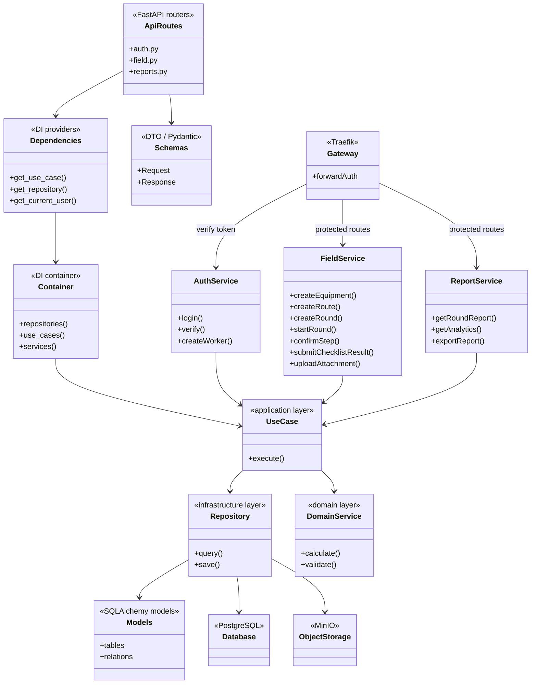

# Быстрый старт

Документ для команды разработки и демонстрации: куда отправлять запросы, где взять мобильное приложение, как поднять backend и web локально.

## Диаграммы

Диаграмма инфраструктуры:

Ссылка на диаграмму классов backend: https://app.diagrams.net/?src=about#G1LQiA1fvFN02PiY0RRAi1_OFXr8NijqE_#%7B%22pageId%22%3A%22gKCYxr75Pmert4DO-K6z%22%7D
```

## Демо-стенд

Backend уже развернут на сервере:

```text
http://144.31.181.154
```

Все клиенты должны ходить через этот base URL:

```text
http://144.31.181.154/api/...
```

Порты демо-стенда:

```text
80     backend API через Traefik: http://144.31.181.154
8080   Traefik dashboard:        http://144.31.181.154:8080
9000   MinIO API:                http://144.31.181.154:9000
9001   MinIO Console:            http://144.31.181.154:9001
19092  Redpanda Kafka API
5432   PostgreSQL
```

Для мобильного приложения и web нужен именно порт `80`, то есть base URL без явного порта:

```text
http://144.31.181.154
```

Проверка доступности:

```bash
curl http://144.31.181.154/api/auth/health
curl http://144.31.181.154/api/field/health
curl http://144.31.181.154/api/reports/health
```

## Авторизация

Администратор для web:

```bash
curl -s http://144.31.181.154/api/auth/login \
  -H "Content-Type: application/json" \
  -d '{"username":"admin","password":"admin123"}'
```

Работник для мобильного приложения:

```bash
curl -s http://144.31.181.154/api/auth/login \
  -H "Content-Type: application/json" \
  -d '{"username":"worker","password":"worker123"}'
```

В ответе нужно взять `access_token` и передавать его в защищенные ручки:

```http
Authorization: Bearer <access_token>
```

## APK мобильного приложения

APK для установки на MIG-смартфон:

```text
Ссылка на APK мобильного приложения:
```

Для входа можно использовать демо-пользователя:

```text
Логин: worker
Пароль: worker123
```

Если нужен новый работник, его создает администратор:

```bash
ADMIN_TOKEN=$(curl -s http://144.31.181.154/api/auth/login \
  -H "Content-Type: application/json" \
  -d '{"username":"admin","password":"admin123"}' \
  | python3 -c 'import json,sys; print(json.load(sys.stdin)["access_token"])')

curl -s -X POST http://144.31.181.154/api/auth/admin/workers \
  -H "Authorization: Bearer $ADMIN_TOKEN" \
  -H "Content-Type: application/json" \
  -d '{
    "username": "ivanov",
    "password": "ivanov123",
    "full_name": "Иванов Иван Иванович",
    "employee_id": "worker-ivanov",
    "qualification_id": "OPERATOR-TU",
    "department_id": "DEPT-UGP"
  }'
```

После этого работник входит в мобильное приложение с логином `ivanov` и паролем `ivanov123`.

## Запуск backend локально

Перейти в папку backend:

```bash
cd backend
```

Создать `.env`:

```bash
cp .env.example .env
```

Запустить инфраструктуру:

```bash
docker compose up -d postgres minio redpanda
```

Применить миграции field-service:

```bash
docker compose --profile tools run --rm field-migrations
```

Запустить сервисы:

```bash
docker compose up -d --build auth-service field-service report-service traefik
```

Заполнить демо-данными:

```bash
docker compose run --rm --no-deps field-service python -m app.cli.seed_demo
```

Проверить:

```bash
curl http://127.0.0.1/api/auth/health
curl http://127.0.0.1/api/field/health
curl http://127.0.0.1/api/reports/health
```

Локальный backend будет доступен по адресу:

```text
http://127.0.0.1
```

Локальные порты:

```text
80     backend API через Traefik: http://127.0.0.1
8080   Traefik dashboard:        http://127.0.0.1:8080
5432   PostgreSQL:               localhost:5432
9000   MinIO API:                http://127.0.0.1:9000
9001   MinIO Console:            http://127.0.0.1:9001
19092  Redpanda Kafka API:       localhost:19092
```

Внутри Docker-сети сервисы обращаются друг к другу по внутренним именам:

```text
auth-service:8000
field-service:8000
report-service:8000
postgres:5432
minio:9000
redpanda:9092
```

Smoke-test:

```bash
python3 scripts/smoke_test.py
```

## Запуск web локально

Перейти в папку frontend:

```bash
cd frontend
```

Установить зависимости:

```bash
npm install
```

Создать `.env`:

```bash
cp .env.example .env
```

Чтобы web отправлял запросы на удаленный backend, указать:

```env
VITE_DATA_SOURCE=backend
VITE_API_BASE_URL=http://144.31.181.154
VITE_PROXY_TARGET=http://144.31.181.154
VITE_AUTH_TOKEN=dev-admin-token
```

Для подключения к локальному backend:

```env
VITE_DATA_SOURCE=backend
VITE_API_BASE_URL=http://127.0.0.1
VITE_PROXY_TARGET=http://127.0.0.1
VITE_AUTH_TOKEN=dev-admin-token
```

Запустить web:

```bash
npm run dev
```

Открыть:

```text
http://localhost:5173
```

Порты web:

```text
5173  Vite dev server: http://localhost:5173
```

Примечание: текущий web-клиент в backend-режиме использует `VITE_AUTH_TOKEN` для запросов к API. Поэтому для демо можно оставить `dev-admin-token` или подставить `access_token`, полученный через `/api/auth/login`.

## Полезные ссылки

- Backend API gateway: `http://144.31.181.154`
- Traefik dashboard локально: `http://127.0.0.1:8080`
- MinIO console локально: `http://127.0.0.1:9001`
- Документация мобильной интеграции: [mobile-integration.md](./mobile-integration.md)
- Документация auth-service: [auth-service.md](./auth-service.md)
- Документация field-service: [field-service.md](./field-service.md)
- Документация report-service: [report-service.md](./report-service.md)
