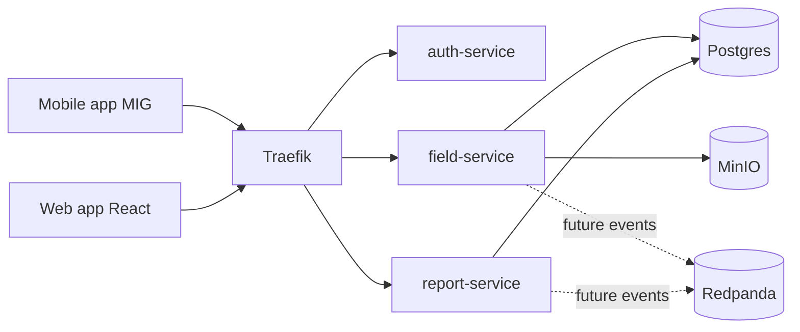

# Backend Services Overview

Backend состоит из трех прикладных микросервисов и инфраструктурных компонентов.

## Микросервисы

```text
auth-service    проверка токена и роли пользователя
field-service   обходы, маршруты, чек-листы, оборудование, дефекты, фото
report-service  отчеты, аналитика, экспорт CSV/JSON/PDF
```

## Инфраструктура

```text
Traefik    API gateway и ForwardAuth
Postgres   основная БД
MinIO      хранение фото и вложений
Redpanda   Kafka-compatible broker для будущих событий
```

## Схема взаимодействия



## Проверка доступа

Все защищенные запросы идут через Traefik.

```text
client -> Traefik -> auth-service -> target service
```

`auth-service` возвращает пользовательские заголовки:

```text
X-User-Id
X-User-Role
X-User-Name
```

Целевые сервисы используют эти заголовки для проверки бизнес-доступа.

Работников для мобильного приложения создает начальник:

```http
POST /api/auth/admin/workers
Authorization: Bearer <admin_access_token>
```

## Документация по сервисам

- [auth-service.md](./auth-service.md)
- [field-service.md](./field-service.md)
- [report-service.md](./report-service.md)

## API-документация

- [mobile-integration.md](./mobile-integration.md)
- [admin-field-api.md](./admin-field-api.md)
- [defect-api.md](./defect-api.md)
- [report-api.md](./report-api.md)

## Запуск

Первичный запуск с чистой БД:

```bash
docker compose up -d postgres minio redpanda
docker compose --profile tools run --rm field-migrations
docker compose up -d auth-service field-service report-service traefik
```

Заполнение демо-данными:

```bash
curl -s -X POST http://127.0.0.1/api/field/admin/seed-demo \
  -H "Authorization: Bearer <admin_access_token>"
```

Smoke-test:

```bash
python3 scripts/smoke_test.py
```

## Авторизация

Клиенты получают токен через `auth-service`:

```bash
curl -s http://127.0.0.1/api/auth/login \
  -H "Content-Type: application/json" \
  -d '{"username":"worker","password":"worker123"}'
```

Для веб-интерфейса начальника:

```bash
curl -s http://127.0.0.1/api/auth/login \
  -H "Content-Type: application/json" \
  -d '{"username":"admin","password":"admin123"}'
```
